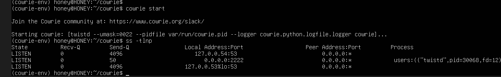
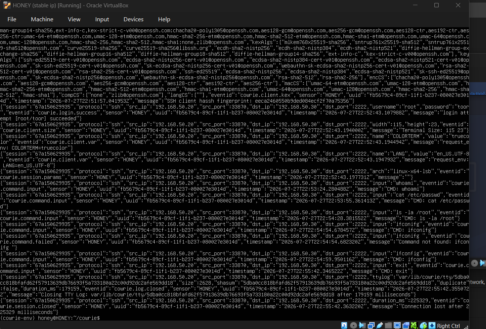
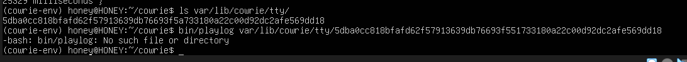
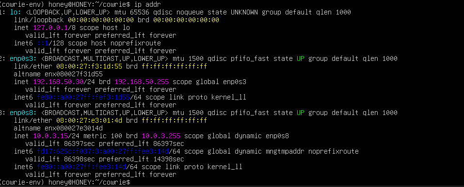
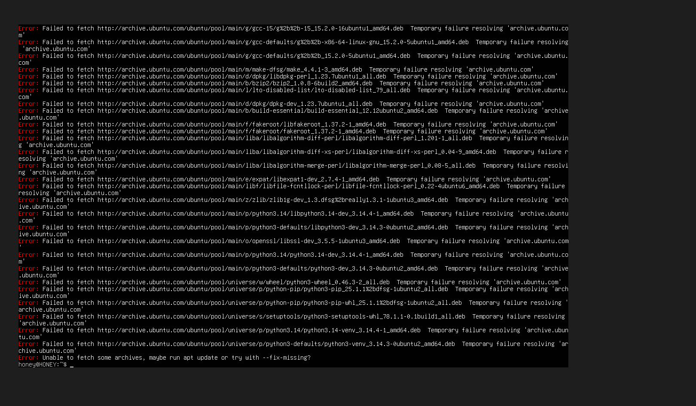

# Cowrie SSH Honeypot & Attack Simulation — Home Lab

A self-hosted, isolated home lab project simulating both sides of an SSH-based intrusion: an attacker probing a system, and a defender reviewing what was captured. Built entirely on free tools inside VirtualBox.

## Summary

- Deployed a **Cowrie SSH/Telnet honeypot** on an isolated Ubuntu Server VM within a segmented lab network, alongside a Kali Linux attacker machine and a Metasploitable2 vulnerable target.
- Configured **static IP addressing** across all lab VMs (netplan, NetworkManager, and legacy `/etc/network/interfaces`) to maintain persistent, isolated internal networking.
- Built Cowrie from source using its current install method (editable pip install + `cowrie init`), resolving dependency and environment issues along the way.
- Simulated a real attacker session via SSH against the honeypot, including credential-based login and post-compromise reconnaissance commands.
- Captured and analyzed **structured JSON logs** and a **full TTY session replay** to review attacker behavior end-to-end.

## Lab Topology

| VM | Role | IP Address |
|---|---|---|
| Kali Linux | Attacker machine | `192.168.50.20` |
| Metasploitable2 | Vulnerable target (separate exercise) | `192.168.50.10` |
| Ubuntu Server + Cowrie | Honeypot / monitored decoy | `192.168.50.30` |

All VMs run on an isolated internal-only VirtualBox network (`labnet`) — no external exposure, no internet access except during setup.

## How it works

The Ubuntu Server VM ran Cowrie and acted as the decoy/monitored system, while Kali played the role of the attacker. Every connection attempt, login, and command typed against the honeypot was logged and later replayable — simulating how a SOC analyst would review captured attacker activity after an incident.

## Evidence

**1. Cowrie deployed and listening on port 2222**

**2. Captured attack — JSON logs**

Login attempt with guessed credentials (`root`/`toor`) succeeded, followed by recon commands (`whoami`, `/etc/passwd` enumeration, `ls -la /root`, `ifconfig`) — all logged with timestamps, source IP, and even a typo I made mid-session (`ifconifg`), which Cowrie correctly returned as "command not found," just like a real shell.

**3. Full TTY session replay**

Cowrie saves a keystroke-by-keystroke replay of every session, playable with the `playlog` tool — this is the same kind of evidence a SOC analyst would use to reconstruct an intrusion after the fact.

**4. Persistent static IP configuration**

Configured via netplan so the lab network survives reboots instead of resetting.

**5. Troubleshooting: isolated network vs. package installation**

Hit a real infrastructure problem — the honeypot VM's isolated network (by design, for security) blocked internet access needed to install Cowrie's dependencies. Solved by temporarily adding a second NAT-only adapter for setup, while keeping the primary lab-facing adapter fully isolated.

## How I'd explain this in an interview

> "I built a Cowrie SSH honeypot inside an isolated home lab network, alongside an attacker VM (Kali) and a vulnerable target VM (Metasploitable2). I deployed Cowrie on Ubuntu Server, configured it to capture SSH login attempts and shell activity, then simulated an attack from Kali — logging in with guessed credentials and running common attacker recon commands. Afterward, I reviewed the structured JSON logs and used Cowrie's TTY replay tool to play back the session keystroke-by-keystroke, the same way an analyst would investigate a real intrusion."

## What I learned

The biggest learning experience was adapting to a changed install process — the documentation I initially followed was outdated, and the project had moved from a manual `cp cowrie.cfg.dist cowrie.cfg` setup to a `cowrie init`-based workflow bundled inside the Python package. I diagnosed this by comparing my directory contents against the actual GitHub source rather than trusting an older guide.

I also learned how differently Linux distributions handle network persistence — Ubuntu Server uses netplan, Kali uses NetworkManager, and older Debian-based systems (Metasploitable2) use the legacy `/etc/network/interfaces` file — and had to configure static IPs three different ways across the same lab to keep the network stable across reboots.

## What problem does this solve?

Honeypots help security teams detect and study active intrusions or reconnaissance attempts by presenting an intentionally exposed, monitored decoy. If a real attacker probes or logs into a honeypot, defenders get full visibility into their tools, commands, and intent — without risking real systems — which can inform detection rules and threat intelligence.

## What was the hardest part

The hardest part was troubleshooting a broken Cowrie installation. A `git clone` silently failed partway through because the honeypot VM was on an isolated internal network with no internet access yet — this left an incomplete repo missing its configuration template. I diagnosed this by comparing my local directory structure directly against Cowrie's GitHub repository, discovered the project's install method had changed to use `cowrie init` instead of manually copying a config file, and rebuilt the Python virtual environment from scratch after an unrelated cleanup step (`rm -rf`) accidentally deleted it, causing a confusing "externally managed environment" pip error.

## Tools used

- VirtualBox (hypervisor)
- Kali Linux (attacker VM)
- Ubuntu Server 26.04 LTS (honeypot host)
- [Cowrie](https://github.com/cowrie/cowrie) (SSH/Telnet honeypot)
- Metasploit Framework (used in a related exercise on the same lab network)
